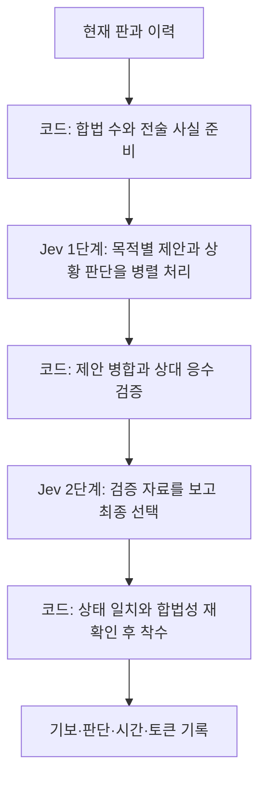

# Jev 몽진 대국 엔진 설계안

상태: 설계 제안. 작성일 2026-09-20. 이번 문서는 구현 범위를 정리한 것으로, 실행 코드와 현재 대국 서버에는 적용하지 않았다. 현재 동작은 [전술 보조 v3 설계](DESIGN.md)를 따른다.

## 1. 목표와 첫 결과물

Jev가 여러 관점에서 수를 제안하고, 몽진 엔진이 상대 응수를 계산한 뒤, Jev가 최종 수를 선택하는 대국 상대를 만든다. 제안 구조는 **Jev 2단계 + 코드 검증**이다. 층의 수보다 좋은 대안의 확보, 계산 자료의 정확성, 상대 위협의 확인을 우선한다.

첫 결과물은 오인이 기존 로컬 웹 보드에서 흑 또는 백으로 대국할 수 있는 실험용 프로토타입이다. 기존 왕 이동·호위 배치 조작과 시각 스타일을 유지하고, 담당별 제안과 검증 결과를 볼 수 있는 패널을 추가한다. 데스크톱 브라우저의 마우스·트랙패드 조작을 우선 검증한다. 모바일 배포나 스토어 출시는 이번 범위가 아니다.

성공 여부는 사람이 한 수 둔 뒤 새 에이전트가 실제 Jev 요청과 엔진 검증을 거쳐 합법 수로 응답하고, 그 전 과정이 기보와 판단 기록으로 재현되는지부터 확인한다. 오인에게 승리한다는 결과를 미리 보장하지 않는다.

## 2. 이번 대국에서 확인한 문제

원본은 `outputs/jev-live/mongjin-live-mu8k7jud-df964c1c/`다. 오인이 흑으로 29수 만에 목표에 도달했고, 엔진 재생으로 모든 수와 최종 해시를 확인했다.

- 백의 14번 착수 모두 v3가 최고 추정값으로 표시한 후보 중 하나였다. 모델 선택과 코드 평가의 기여를 분리해서 검증해야 한다.
- 20수 후 정적 우회 경로는 백 11걸음·흑 5걸음인데, 점수에는 장애물을 무시한 백 2칸·흑 5칸의 거리가 들어갔다. 경로 자료와 종합 평가가 서로 다른 방향을 가리켰다.
- 14번 중 11번은 30,000노드 제한으로 공통 탐색 깊이가 3ply에서 멈췄다. 26수 직전 판을 오프라인에서 4ply까지 재계산하자 23개 합법 수 모두 강제패였다. 당시의 3ply 계산은 이를 찾지 못했다.

마지막 사례는 더 깊이 읽으면 패배를 일찍 알아차릴 수 있음을 보여준다. 그 국면에서 이미 잃은 승리 기회를 되살릴 수 있었다는 증거는 아니다. 이 대국의 수를 외우게 하거나, 몇 수 더 버티는 것만으로 기력이 개선됐다고 평가하지 않는다.

## 3. 한 턴의 흐름

일반적인 턴은 Jev를 순차적으로 두 번 호출한다. 한 단계 안의 여러 질문은 같은 요청에 넣고, 다음 단계에 필요한 출력은 코드가 명시적으로 전달한다. 같은 요청의 질문끼리는 서로의 답을 읽거나 토론한다고 가정하지 않는다. TypeSafe의 [독립 질문 조합 방식](https://docs.typesafe.ai/concepts/how-to-build-with-system-one)을 따른다.

정확한 승패 검사로 한 수가 확정되는 턴은 API를 생략할 수 있다. 복구를 위해 제안을 다시 받아야 하는 경우에는 호출 수가 늘어나며, 이를 일반적인 두 번 호출과 구분해 기록한다.

## 4. 코드가 맡는 일

규칙 판정은 기존 `src/core/`만 사용한다. 보드 크기, 왕·호위 이동, 목표 도달, 포획·포위, 합법 수와 반복 규칙을 새로 구현하거나 변경하지 않는다.

| 제공 자료 | 처리 원칙 |
| --- | --- |
| 현재 판·턴·호위·이력 | 엔진 상태와 관측을 검증하고 고정된 스냅샷으로 처리 |
| 모든 합법 수 | 안정적인 ID를 부여하고 모델이 새 좌표나 수를 발명하지 않게 함 |
| 즉승·상대의 다음 수 승리 | 실제 수를 적용해 전수 확인 |
| 포획과 교환 | 착수 직후 포획과 되잡는 응수를 구분. 보유 호위와 판 위 호위를 모두 재료에 포함 |
| 왕 경로와 공격 칸 | 현재 말 배치와 공격 범위를 반영한 경로를 계산. 다른 말이 고정된 추정임을 명시 |
| 상대 목표 도달 위협 | 상대의 왕 이동·배치·포획 응수를 실제 턴 순서로 검토 |
| 계산 범위 | 완료 깊이, 노드, 중단 이유, 검사하지 못한 부분을 함께 전달 |

각 자료는 `확인된 사실`, `범위 안에서 증명된 승패`, `추정`, `미확인`으로 구분한다. 미확인을 안전으로 표시하지 않는다. 상대 응수 예시는 실제로 가능한 수순이어야 하며, 상대가 반드시 그 수순을 따른다고 쓰지 않는다.

## 5. Jev 1단계: 목적별 제안과 상황 판단

다섯 담당과 기본 담당이 모두 매 턴 제안한다. 상황 판단의 확률이 낮다는 이유로 담당을 끄지 않는다. 각 담당은 같은 합법 후보 집합을 보되, 담당 목적에 필요한 정보를 명확하게 안내받는다.

| 담당 | 제안 질문의 초점 | 함께 묻는 상황 판단 |
| --- | --- | --- |
| 생존 | 우리 왕의 포획·포위 위험을 줄이고 퇴로를 확보하는 수 | 지금 퇴로 확보를 우선해야 하는가? |
| 차단 | 상대 왕의 목표 도달을 늦추거나 막는 수 | 지금 상대 왕의 진로 차단을 우선해야 하는가? |
| 돌파 | 우리 왕이 지나갈 길을 여는 수 | 호위로 현재 막힌 길을 열어야 하는가? |
| 교환 | 상대의 되잡기까지 고려한 호위 교환 수 | 현재 유리한 호위 교환 기회가 있는가? |
| 전진 | 목표 도달 경쟁에서 도움이 되는 왕 이동 | 지금 왕 전진을 우선해야 하는가? |
| 기본 | 특정 목적에 묶이지 않은 최선의 제안 | 별도 상황 판단 없음 |

제안은 역할별 `Choice` 6개, 상황 판단은 `Noul` 5개를 한 요청에 넣는 것으로 시작한다. 각 제안은 합법 수 ID 하나와 분포를 반환한다. 해당 목적에 적합한 수가 없으면 기본적으로 가능한 수를 억지로 좋다고 포장하지 않도록 `제안 없음` 선택지를 전문 담당에 둔다. 기본 담당은 반드시 합법 수 중에서 제안한다.

상황 판단은 해당 질문의 예·아니오에 관한 모델 추정이다. 즉승이나 현재 왕 포획 가능 여부처럼 코드가 확정할 수 있는 사실은 다시 모델에게 맞혀보라고 묻지 않는다. 위 Noul 질문들은 검증 자료에 근거한 우선순위 판단으로 한정한다. [Noul 정의](https://docs.typesafe.ai/primitives/noul)

첫 요청의 상황 판단은 같은 요청 안의 제안을 변경하지 않는다. 코드가 상황 판단과 제안을 묶어 마지막 선택 단계에 전달한다. 판별 결과로 담당을 활성화하는 별도 감각층을 두지 않는 이유다.

## 6. 제안 병합과 상대 응수 검증

동일한 수를 여러 담당이 제안하면 하나로 합치되 제안한 담당 목록은 유지한다. 같은 모델의 여러 역할이 일치했다고 해서 독립적인 전문가들이 합의한 것으로 해석하지 않는다. 최초 제안은 최대 여섯 수다.

검증은 두 범위를 구분한다. 전체 합법 수에는 최소한 즉승과 상대 다음 수 승리를 검사한다. 더 깊은 탐색은 중복을 제거한 제안 수를 중심으로 수행한다. 후보를 좁히는 목적은 같은 시간에 각 제안을 더 깊게 검토하는 것이다. 좋은 수가 제안에서 빠질 수 있는 비용도 따로 측정한다.

후보 제한 순서는 다음과 같다.

1. 전체 합법 수에서 즉승이 확인되면 그 수들을 우선한다.
2. 당장 상대 다음 수에 지지 않는 대안이 있으면, 즉패 후보를 선택 대상으로 남기지 않는다. 모든 제안이 즉패이고 제안 밖에 대안이 있으면 그 대안 집합에서 다시 제안받는다.
3. 더 깊은 검증이 강제승을 증명하면 그 후보들을 우선한다. 강제패가 증명된 후보와 결과가 미확정인 후보도 구분한다. 추정 점수가 낮다는 이유만으로 후보를 거부하지 않는다.
4. 모든 제안이 더 깊은 강제패이면, 제안 밖의 대안을 확인하거나 한 번 다시 제안받는다. 일부 제안만 조사하고 판 전체를 강제패라고 선언하지 않는다.
5. 전체 합법 수가 강제패로 검증된 경우에도 다음 수 패배를 피할 수 있으면 그 대안은 유지한다. 전부 즉패라면 그 상태를 그대로 전달한다.

재제안은 최대 한 번이다. 제안 후보 범위를 명시하고 이미 확인한 사실을 재사용한다. 모든 합법 수를 충분히 검토할 시간이 없으면 `전역 결과 미확인`으로 남긴다. 모델 재제안도 API 오류도 무제한 반복하지 않는다.

최종 제안 집합이 하나면 코드가 이를 적용하고 `엔진 검증 후 단일 후보`라고 표시한다. 그 수의 최초 제안자는 별도로 남긴다. 최종 Jev를 호출하지 않았는데 심판이 선택한 것처럼 표시하지 않는다.

## 7. 경로 평가와 탐색의 보완

**경로 평가:** 장애물을 무시한 거리만으로 왕의 진행 상황을 평가하지 않는다. 정적 경로 길이, 현재 막힌 지점, 이동 가능한 퇴로, 상대가 다음 응수로 만들 수 있는 차단을 함께 사용한다. 정적 경로를 확보된 미래 경로로 취급하지 않는다. 도달 불가와 계산 미완료도 구분한다.

경로는 최소한 제안 직후와 공통 탐색 끝의 평가에 반영하는 것을 목표로 한다. 계산 비용은 판·색을 키로 캐시하고 후보 수를 제한해 관리한다. 기하학적 거리를 계산 절약용 대체 정보로 쓰는 경우에는 별도 표기하며, 경로를 반영한 평가와 설명 없이 섞지 않는다.

**상대 응수:** 기본 비교는 양쪽이 두 번씩 행동하는 4ply 완료를 목표로 한다. 상대 응수가 남아 있는 불안정한 수순을 우리 쪽 좋은 착수에서 끊고 좋은 교환이라고 판단하지 않도록 한다. 목표 도달 임박, 왕 포획·포위 위협, 진행 중인 교환은 추가 탐색 대상으로 삼는다.

선택적 연장은 정해진 시간·노드·깊이 상한 안에서 수행한다. 특정 공격 수만 골라 본 결과는 참고 자료다. 강제승이나 강제패로 표시하려면 해당 증명에 필요한 모든 방어 응수가 검증돼야 한다. 통상 탐색과 추가 탐색의 깊이 및 범위를 각각 기록하고, 비교 점수는 공통으로 완료한 깊이를 사용한다. 추가로 찾은 정확한 종국 증명은 별도로 활용할 수 있다.

깊이를 더 읽는 것만으로 이번 패배가 해결된다고 가정하지 않는다. 판의 진로가 막히는 앞선 시점에 차단·돌파 대안을 확보하는 일과 함께 검증한다. 평가 가중치는 임시 정책으로 버전 관리하고, 개발 국면을 본 뒤 고친 정책으로 같은 국면을 평가한 결과를 독립 검증이라고 부르지 않는다.

## 8. Jev 2단계: 최종 선택

Jev는 원래 판과 승리 목표, 제안된 수, 역할별 상황 판단, 상대 응수 검증을 받는다. 최종 질문은 이 집합에서 우리 편의 승리에 가장 도움이 되는 수를 고르는 `Choice` 하나다.

최종 입력에서 v3의 `BEST/LOWER` 꼬리표와 최고 엔진 점수를 따르라는 지시는 제거한다. 종합 점수는 분석 로그와 엔진 대조군을 위해 남길 수 있지만, 모델 입력에는 판단 근거가 되는 개별 사실·추정·검증 범위를 우선 제공한다.

최종 응답의 ID를 그대로 적용한다. API 응답 뒤의 전진 보너스, 반복 감점, 역할별 분포의 임의 가중 합으로 선택을 덮어쓰지 않는다. 역할별 Choice와 Noul은 서로 다른 질문이므로 확률을 더하거나 곱해 하나의 승률로 만들지 않는다.

세 확률 표시는 분리한다.

- Noul: 특정 상황 판단이 참이라는 모델의 추정.
- 역할별 Choice: 그 역할의 질문에 적합한 답에 대한 후보 분포.
- 최종 Choice: 검증된 제안 집합 중 가장 적합한 답에 대한 후보 분포.

이는 경기의 최종 승률 예측과 다르다. 실제 몽진에서 확률과 판단 정확도가 얼마나 맞는지는 별도 평가 대상이다. 높은 선택 확률이나 여러 역할의 같은 제안을 승리 보장으로 표시하지 않는다. [Choice 정의](https://docs.typesafe.ai/primitives/choice)

## 9. 오류·시간·상태 처리

실전 한 수 30초 상한, 게임 240ply 상한을 유지하는 안이다. 정상 목표는 95%의 착수를 8초 안에 마치는 것으로 제안하되, 이는 아직 측정하지 않은 성능 목표다. 질문 수에 따라 비용이 증가하므로 단계별 토큰과 실제 대기 시간을 모두 기록한다.

예산은 사실 준비·첫 API·응수 검증·최종 API·기록에 분배하고 하나의 절대 마감 시간을 공유한다. 탐색 노드·연장 깊이의 구체적인 기본값은 29수 대국과 독립 국면으로 측정한 뒤 고정한다. 4ply 완료 여부를 기능 요구와 구분해 기록하고, 미완료 결과를 완료한 것처럼 전달하지 않는다.

API 실패·잘못된 ID·기한 초과에는 판을 이동시키지 않고 오류와 완료된 단계까지 저장한다. 엔진 전용 모드는 별도 대조군이며 API 실패 때 조용히 대신 두지 않는다. 사용자의 재시도에서는 같은 판인지 확인하고 재사용 가능한 분석과 신규 요청을 구분한다.

턴 시작의 gameId·ply·stateHash를 끝까지 유지한다. 대기 중 새 대국이나 색 변경이 일어나면 이전 요청을 취소하고 오래된 응답을 적용하지 않는다. 착수 직전에 합법성과 상태를 다시 확인한다.

## 10. 대국 화면과 기록

기존 보드 옆에 다음 내용을 단계별로 표시한다.

- 상황 판단: 생존·차단·돌파·교환·전진의 추정과 질문 의미.
- 제안: 담당별 실제 수, 제안 없음, 중복 제안.
- 검증: 상대의 실제 가능한 응수 예시, 확인된 패배 위험, 미확인 항목.
- 결정: 최종 Jev 선택, 엔진의 즉승 확정, 검증 후 단일 후보를 구분.
- 기록: 단계별 소요 시간, API 호출 수·토큰, 계산 범위.

기본 화면은 보드와 현재 선택을 중심으로 간단하게 두고 상세 정보는 펼쳐 볼 수 있게 한다. 제안 수를 선택하면 출발·도착 칸과 검증 수순을 판에서 확인하는 흐름을 제안한다. 모델은 생각 설명을 생성하지 않으므로 표시 문장은 실제 응답과 엔진 사실에서 만들고, 이를 Jev의 독백처럼 꾸미지 않는다.

기보는 기존 MGN과 JSON 재생 형식을 유지한다. JSONL에는 상태 해시, 질문·응답 원본, 후보 ID 대응, 탈락 근거, 각 판단의 출처, 복구 여부를 추가한다. 모델 ID, 규칙·프로토콜·정책 버전, 입력 구성과 탐색 예산도 manifest에 보존한다. API 키는 기존 서버 전용 설정을 재사용하며 기록에 넣지 않는다.

## 11. 구현 범위와 순서

새 전략의 임시 ID는 `parallel-v4`다. 현재 v3를 덮어쓰지 않고 별도 옵션으로 구현한다.

| 작업 | 예상 위치 | 완료 확인 |
| --- | --- | --- |
| 실패 국면과 전술 자료 보강 | `tests/fixtures/`, 관련 테스트 | 29수 원본의 차단·퇴로·26수 직전 판을 합법 이력으로 재현 |
| 경로 평가·위협 연장 | `src/agents/mongjin-features.ts`, `mongjin-search.ts` 또는 새 모듈 | 막힌 길과 열린 길 구분, 응수 뒤 교환 평가, 예산 준수 |
| 2단계 Jev 에이전트 | 새 `src/agents/jev-parallel.ts`, 공용 API 처리 | 6개 제안·5개 상황 판단, 후보 검증, 최종 ID 적용 |
| 전략 선택과 기록 | `src/web/agent-bridge.ts`, `server.ts`, 기록 타입 | v3/v4 출처와 단계를 구분하고 오래된 응답 차단 |
| 판단 패널 | `src/web/public/` | 실제 조작으로 착수·후보 표시·재시도·색 교환 확인 |
| 비교 실행기와 보고서 | 새 `scripts/verify-jev-parallel.ts`, 콘텐츠 검증 문서 | 고정 조건에서 흑백 교환 대국과 원본 재생 |

v3를 대조군으로 남기려면 공유 평가·탐색 함수의 동작이 조용히 바뀌지 않아야 한다. 새 평가와 연장 정책은 명시적인 버전/옵션 또는 별도 모듈로 분리한다. 공용 API 처리를 추출할 경우에도 기존 direct-choice와 v2/v3 요청·오류 처리를 회귀 검사한다.

구현 순서는 전술 계산 보강 → 단일 턴의 실제 API 왕복 → 기록과 웹 연결 → 흑백 교환 검증이다. 첫 완전한 한 턴을 확인한 뒤 기능을 확장한다. 자동 학습, 별도 대형 모델의 착수 대체, 추가 감각 게이트 층, 모바일 출시, 실제 승률 예측 모델은 첫 구현에 포함하지 않는다.

## 12. 검증 계획과 완료 기준

기능 검증과 기력 검증을 분리한다.

기능 검증은 즉승·왕 포획·포위 회피·필수 후퇴·호위 교환·막힌 경로·목표 도달 임박을 포함한다. 특히 다음 오류를 막는다: 감각 판단으로 역할을 생략함, 응수 검토 중단을 안전으로 해석함, 후보 내 강제패를 전체 강제패로 표시함, 모델 응답을 점수로 덮어씀, 실패 후 대체 엔진이 몰래 착수함.

개발 때 본 국면과 정책을 고정한 뒤 새로 만든 평가 국면을 구분한다. 29수 대국의 마지막 부분은 패배 인식 검사이고, 앞부분은 유효한 차단·돌파 대안이 실제 제안에 들어오는지를 검사한다. 이전 판보다 단순히 오래 버텼는지는 기력 합격 기준이 아니다.

기력 비교의 대조군은 다음 네 가지다.

| 대조군 | 확인할 질문 |
| --- | --- |
| 고정된 기존 v3 | 종전 방식보다 전체 대국이 개선되는가? |
| 새 평가를 쓰는 엔진만의 선택 | 코드 계산 개선만으로 얻는 효과는 어느 정도인가? |
| 새 자료를 받은 단일 Jev Choice | 다관점 제안 없이도 같은 효과가 나는가? |
| 새 2단계 Jev | 역할별 제안과 최종 판단이 추가로 도움을 주는가? |

최종 선택 자체의 기여는 고정된 동일 후보·동일 분석 자료에서 엔진 선택과 Jev 선택을 따로 비교한다. 전체 대국 비교에서는 코드 탐색 예산과 시간 상한을 맞추고, 후보 범위와 API 호출 수가 다른 점을 보고한다.

초기 비교안은 고정 울타리 전략과 별도 전술 상대 두 종류, seed 3개, 흑백 교환으로 방식당 12판이다. 네 방식이면 총 48판이다. 먼저 소규모 연결 점검에서 토큰·비용·지연을 측정하고 본 비교의 정책을 동결한다. 작은 표본이므로 승률 우위를 확정하는 실험으로 해석하지 않는다. TypeSafe 모델에는 현재 사용 중인 seed 설정이 없으므로 출력의 완전 재현성을 약속하지 않는다.

측정값은 정상 승패, 피할 수 있는 즉패 선택, 위협 인식, 유효한 방어 후보의 포함 여부, 후보 중복, 탐색 완료 깊이, API 오류, 평균·95백분위 지연, 토큰이다. 기계가 구분할 수 있는 사실을 벗어난 '좋은 수'의 정답은 별도 검증 없이 만들지 않는다.

필수 검사 `npm run typecheck`, `npm test`, `npm run build`와 실제 브라우저 조작 검증을 수행한다. 시간 초과·불법 수·API 오류·수 상한은 정상 승리나 규칙상 무승부에 합산하지 않는다. 모든 비교 기보의 상태 해시와 최종 결과를 엔진으로 재생한다.

완료 보고에서는 구현 완료, 실제 화면 확인, 전술 결함 개선, 기력 개선 여부를 각각 적는다. 이번 설계안 작성 시점에는 새 구조가 구현되거나 기력이 검증된 상태가 아니다.
